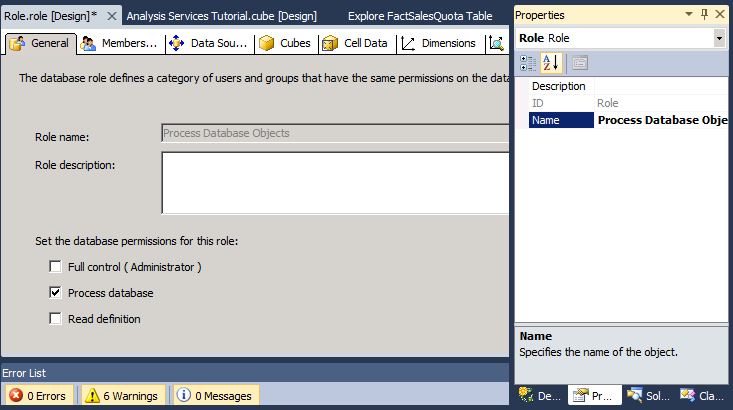
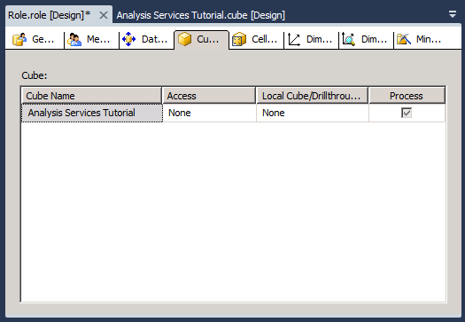

# Granting Process Database Permissions
  After you install an instance of [!INCLUDE[ssASnoversion](../includes/ssasnoversion-md.md)], all members of the [!INCLUDE[ssASnoversion](../includes/ssasnoversion-md.md)] server administrator role in that instance have server-wide permissions to perform any task within the instance of [!INCLUDE[ssASnoversion](../includes/ssasnoversion-md.md)]. By default, no other users have any permission to administer or view any objects in the instance of [!INCLUDE[ssASnoversion](../includes/ssasnoversion-md.md)].

 A member of the server administrator role can grant users administrative access on a server-wide basis by making them members of the role. A member of the server administrator role can also grant users access on a more limited basis by granting them limited or complete administrative or access permissions at the database level. Limited administrative permissions include process or read definition permissions at the database, cube, or dimension level.

 In the tasks in this topic, you will define a Process Database Objects security role that grants members of the role permission to process all database objects, but no permission to view data within the database.

## Defining a Process Database Objects Security Role

1.  In Solution Explorer, right-click **Roles** and then click **New Role** to open the Role Designer.

2.  Click the **Process database** check box.

3.  In the Properties window, change the **Name** property for this new role to `Process Database Objects Role`.

     

4.  Switch to the **Membership** tab of Role Designer and click **Add**.

5.  Enter the accounts of the Windows domain users or groups who will be members of this role. Click **Check Names** to verify the account information, and then click **OK**.

6.  Switch to the **Cubes** tab of Role Designer.

     Notice that members of this role have permissions to process this database, but have no permission to access the data in the [!INCLUDE[ssASnoversion](../includes/ssasnoversion-md.md)] Tutorial cube and have no local cube/drillthrough access, as shown in the following image.

     

7.  Switch to the **Dimensions** tab of Role Designer.

     Notice that members of this role have permissions to process all dimension objects in this database, and, by default, have read permissions to access each dimension object in the [!INCLUDE[ssASnoversion](../includes/ssasnoversion-md.md)] Tutorial database.

8.  On the **Build** menu, click **Deploy Analysis Services Tutorial**.

     You have now successfully defined and deployed the Process Database Objects security role. After a cube is deployed to the production environment, the administrators of the deployed cube can add users to this role as required to delegate processing responsibilities to specific users.

> [!NOTE]
>  A completed project for Lesson 10 is available by downloading and installing the samples. For more information, see [Install Sample Data and Projects for the Analysis Services Multidimensional Modeling Tutorial](install-sample-data-and-projects.md).

## See Also
 [Roles and Permissions &#40;Analysis Services&#41;](multidimensional-models/roles-and-permissions-analysis-services.md)

