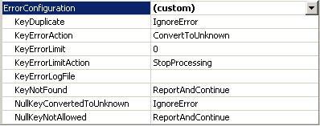
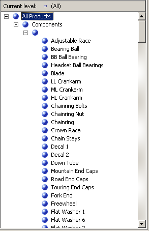
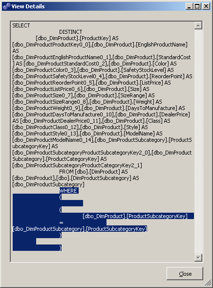
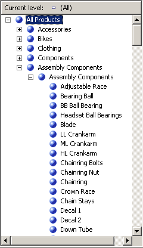

# Defining the Unknown Member and Null Processing Properties
  When [!INCLUDE[ssASnoversion](../includes/ssasnoversion-md.md)] processes a dimension, all the distinct values from the underlying columns in the tables, or views in the data source view, populate the attributes in the dimension. If [!INCLUDE[ssASnoversion](../includes/ssasnoversion-md.md)] encounters a null value during processing, by default, it converts this null to a zero for numeric columns or to an empty string for string columns. You can modify the default settings or convert null values in your extract, transform, and load process (if any) of the underlying relational data warehouse. Additionally, you can have [!INCLUDE[ssASnoversion](../includes/ssasnoversion-md.md)] convert the null value to a designated value by configuring three properties: the **UnknownMember** and **UnknownMemberName** properties for the dimension, and the **NullProcessing** property for the dimension's key attribute.

 The Dimension Wizard and the Cube Wizard will enable these properties for you based on whether the key attribute of a dimension is nullable or the root attribute of a snowflake dimension is based on a nullable column. In these cases, the **NullProcessing** property of the key attribute will be set to **UnknownMember** and the **UnknownMember** property will be set to **Visible**.

 However, when you build snowflaked dimensions incrementally, as we are doing with the Product dimension in this tutorial, or when you define dimensions using Dimension Designer and then incorporate these existing dimensions into a cube, the **UnknownMember** and **NullProcessing** properties might need to be set manually.

 In the tasks in this topic, you will add the product category and product subcategory attributes to the Product dimension from snowflaked tables that you will add to the [!INCLUDE[ssSampleDBCoShort](../includes/sssampledbcoshort-md.md)] DW data source view. You will then enable the **UnknownMember** property for the Product dimension, specify `Assembly Components` as the value for the **UnknownMemberName** property, relate the `Subcategory` and `Category` attributes to the product name attribute, and then define custom error handling for the member key attribute that links the snowflaked tables.

> [!NOTE]
>  If you have added the Subcategory and Category attributes when you originally defined the [!INCLUDE[ssASnoversion](../includes/ssasnoversion-md.md)] Tutorial cube using the Cube Wizard, these steps would have been performed for you automatically.

## Reviewing Error Handling and Unknown Member Properties in the Product Dimension

1.  Switch to Dimension Designer for the **Product** dimension, click the **Dimension Structure** tab, and then select **Product** in the **Attributes** pane.

     This enables you to view and modify the properties of the dimension itself.

2.  In the Properties window, review the **UnknownMember** and **UnknownMemberName** properties.

     Notice that the **UnknownMember** property is not enabled, because its value is set to **None** instead of **Visible** or **Hidden**, and that no name is specified for the **UnknownMemberName** property.

3.  In the Properties window, select **(custom)** in the **ErrorConfiguration** property cell, and then expand the **ErrorConfiguration** properties collection.

     Setting the **ErrorConfiguration** property to **(custom)** allows you to view the default error configuration settings - it does not change any settings.

4.  Review the key and null key error configuration properties, but do not make any changes.

     Notice that, by default, when null keys are converted to the unknown member and the processing error associated with this conversion is ignored.

     The following image shows the property settings for the **ErrorConfiguration** properties collection.

     

5.  Click the **Browser** tab, verify that **Product Model Lines** is selected in the **Hierarchy** list, and then expand `All Products`.

     Notice the five members of the Product Line level.

6.  Expand **Components**, and then expand the unlabeled member of the **Model Name** level.

     This level contains the assembly components that are used when building other components, starting with the **Adjustable Race** product, as shown in the following image.

     

## Defining Attributes from Snowflaked Tables and a Product Category User-Defined Hierarchy

1.  Open Data Source View Designer for the [!INCLUDE[ssSampleDBCoShort](../includes/sssampledbcoshort-md.md)] DW data source view, select **Reseller Sales** in the **Diagram Organizer** pane, and then click **Add/Remove Objects** on the **Data Source View** menu of [!INCLUDE[ssBIDevStudioFull](../includes/ssbidevstudiofull-md.md)].

     The **Add/Remove Tables** dialog box opens.

2.  In the **Included objects** list, select **DimProduct (dbo)**, and then click **Add Related Tables**.

     Both **DimProductSubcategory (dbo)** and **FactProductInventory (dbo)** are added. Remove **FactProductInventory (dbo)** so that just the **DimProductSubcategory (dbo)** table is added to the **Included objects** list.

3.  With the **DimProductSubcategory (dbo)** table selected by default as the table most recently added, click **Add Related Tables** again.

     The **DimProductCategory (dbo)** table is added to the **Included objects** list.

4.  Click **OK**.

5.  On the **Format** menu of [!INCLUDE[ssBIDevStudio](../includes/ssbidevstudio-md.md)], point to **Auto Layout**, and then click **Diagram**.

     Notice that the **DimProductSubcategory (dbo)** table and **DimProductCategory (dbo)** table are linked to each other, and also to the **ResellerSales** table through the **Product** table.

6.  Switch to Dimension Designer for the **Product** dimension, and then click the **Dimension Structure** tab.

7.  Right-click anywhere in the **Data Source View** pane, and then click **Show All Tables**.

8.  In the **Data Source View** pane, locate the **DimProductCategory** table, right-click **ProductCategoryKey** in that table, and then click **New Attribute from Column**.

9. In the **Attributes** pane, change the name of this new attribute to `Category`.

10. In the Properties window, click in the **NameColumn** property field and then click the browse (**...**) button to open the **Name Column** dialog box.

11. Select **EnglishProductCategoryName** in the **Source column** list and then click **OK**.

12. In the **Data Source View** pane, locate the **DimProductSubcategory** table, right-click **ProductSubcategoryKey** in that table, and then click **New Attribute from Column**.

13. In the **Attributes** pane, change the name of this new attribute to `Subcategory`.

14. In the Properties window, click in the **NameColumn** property field and then click the browse **(...)** button to open the **Name Column** dialog box.

15. Select **EnglishProductSubcategoryName** in the **Source column** list and then click **OK**.

16. Create a new user-defined hierarchy called **Product Categories** with the following levels, in order from top to bottom: `Category`, `Subcategory`, and **Product Name**.

17. Specify `All Products` as the value for the **AllMemberName** property of the Product Categories user-defined hierarchy.

## Browsing the User-Defined Hierarchies in the Product Dimension

1.  On the toolbar of the **Dimension Structure** tab of **Dimension Designer** for the **Product** dimension, click **Process**.

2.  Click **Yes** to build and deploy the project, and then click **Run** to process the **Product** dimension.

3.  When processing has succeeded, expand **Processing Dimension 'Product' completed successfully** in the **Process Progress** dialog box, expand **Processing Dimension Attribute 'Product Name' completed**, and then expand **SQL queries 1**.

4.  Click the SELECT DISTINCT query and then click **View Details**.

     Notice that a WHERE clause has been added to the SELECT DISTINCT clause that removes those products that have no value in the ProductSubcategoryKey column, as shown in the following image.

     

5.  Click **Close** three times to close all processing dialog boxes.

6.  Click the **Browser** tab in Dimension Designer for the **Product** dimension, and then click **Reconnect**.

7.  Verify that **Product Model Lines** appears in the **Hierarchy** list, expand `All Products`, and then expand **Components**.

8.  Select **Product Categories** in the **Hierarchy** list, expand `All Products`, and then expand **Components**.

     Notice that none of the assembly components appear.

 To modify the behavior mentioned in the previous task, you will enable the **UnknownMember** property of the Products dimension, set a value for the **UnknownMemberName** property, set the **NullProcessing** property for the `Subcategory` and **Model Name** attributes to **UnknownMember**, define the `Category` attribute as a related attribute of the `Subcategory` attribute, and then define the **Product Line** attribute as a related attribute of the **Model Name** attribute. These steps will cause [!INCLUDE[ssASnoversion](../includes/ssasnoversion-md.md)] to use the unknown member name value for each product that does not have a value for the **SubcategoryKey** column, as you will see in the following task.

## Enabling the Unknown Member, Defining Attribute Relationships, and Specifying Custom Processing Properties for Nulls

1.  Click the **Dimension Structure** tab in Dimension Designer for the **Product** dimension, and then select **Product** in the **Attributes** pane.

2.  In the **Properties** window, change the **UnknownMember** property to **Visible**, and then change the value for the **UnknownMemberName** property to `Assembly Components`.

     Changing the **UnknownMember** property to either **Visible** or **Hidden** enables the **UnknownMember** property for the dimension.

3.  Click the **Attribute Relationships** tab.

4.  In the diagram, right-click the `Subcategory` attribute and then select **New Attribute Relationship**.

5.  In the **Create Attribute Relationship** dialog box, the **Source Attribute** is `Subcategory`. Set the **Related Attribute** to `Category`. Leave the relationship type set to **Flexible**.

6.  [!INCLUDE[clickOK](../includes/clickok-md.md)]

7.  In the **Attributes** pane, select **Subcategory.**

8.  In the Properties window, expand the **KeyColumns** property and then expand the **DimProductSubcategory.ProductSubcategoryKey (Integer)** property.

9. Change the **NullProcessing** property to **UnknownMember**.

10. In the **Attributes** pane, select **Model Name**.

11. In the Properties window, expand the **KeyColumns** property and then expand the **Product.ModelName (WChar)** property.

12. Change the **NullProcessing** property to **UnknownMember**.

     Because of these changes, when [!INCLUDE[ssASnoversion](../includes/ssasnoversion-md.md)] encounters a null value for the `Subcategory` attribute or the **Model Name** attribute during processing, the unknown member value will be substituted as the key value, and the user-defined hierarchies will be constructed correctly.

## Browsing the Product Dimension Again

1.  On the **Build** menu, click **Deploy Analysis Services Tutorial**.

2.  When deployment has successfully completed, click the **Browser** tab in Dimension Designer for the **Product** dimension, and then click **Reconnect**.

3.  Verify that **Product Categories** is selected in the **Hierarchy** list, and then expand `All Products`.

     Notice that Assembly Components appears as a new member of the Category level.

4.  Expand the `Assembly Components` member of the `Category` level and then expand the `Assembly Components` member of the `Subcategory` level.

     Notice that all the assembly components now appear at the **Product Name** level, as shown in the following image.

     

## Next Lesson
 [Lesson 5: Defining Relationships Between Dimensions and Measure Groups](lesson-5-defining-relationships-between-dimensions-and-measure-groups.md)

