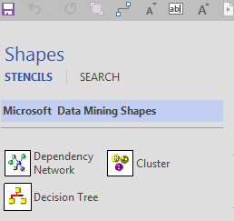

# Viewing Data Mining Models in Visio (Data Mining Add-ins)
  The Visio shapes for data mining let you connect to a server and create a diagram representing an existing data mining model. The diagrams can then be customized using Visio controls, but you can also drill down into data, expose some of the underlying statistics, and work with the underlying model.  
  
## Building a Model Diagram  
 When you open the file containing the Visio shapes for data mining, the **Shapes** pane shows the following shapes.  
  
 If you do not see the data mining shapes when you open Visio, open the template file from the installation folder.  
  
   
  
 To use a shape, drag it to the page. Each of the shapes opens a different wizard, which helps you select source data, set options for the specific diagram type, and specify shading and other display options.  
  
 The following table lists the types of models that you can use with each type of diagram.  
  
|Visio shape|Supported models|  
|-----------------|----------------------|  
|Decision Tree|Use this shape for models based on the decision tree or linear regression algorithms.|  
|Dependency Network|Use this shape for models based on any of the following algorithms: Naive Bayes, Decision Trees, or Association Rules.|  
|Cluster|Use this shape for models based on clustering algorithms.|  
  
 Depending on the type of data in your mining model, the wizard may offer different options. For example, columns that contain continuous numbers are visualized differently than categorical variables.  
  
## Working with Completed Shapes  
 After the diagram is complete, you can use it to browse the data mining model or enhance the diagram for use in presentations.  
  
### Visio Menus  
 Visio provides a variety of rendering controls, themes, and shortcut menus to help enhance a diagram.  
  
-   Use Visio themes to alter diagram colors.  
  
-   Change connectors or diagram layout.  
  
### Data Mining Menus  
 These toolbars and menu items are provided by the add-ins that are specific to each shape or model type  
  
-   Each diagram type has a shortcut menu for the shape that lets you access special options. Although many options in this menu are common to all Visio shapes, some options are unique to the data mining templates  
  
     For example, in a decision tree diagram, you can click an individual node and then collapse the child nodes to make the diagram simpler, or move child nodes to a separate page.  
  
-   Because the shape is bound to the model data, you can also do some amount of exploration using the diagram:  
  
     Filter the nodes that are displayed, or change the level of the tree or depth of the graph.  
  
     Zoom in on specific sections, search for nodes that contain a certain attribute, or filter a dependency graph by its edges (probability).  
  
## Walkthroughs  
 For examples of how to work with and interpret a completed diagram, see these topics:  
  
 [Cluster Diagram Walkthrough](cluster-diagram-walkthrough-data-mining-add-ins.md)  
  
 [Dependency Net Diagram Walkthrough](dependency-network-diagram-walkthrough-data-mining-add-ins.md)  
  
 [Decision Tree Diagram Walkthrough](decision-tree-diagram-walkthrough-data-mining-add-ins.md)  
  
## See Also  
 [Browsing Models in Excel &#40;SQL Server Data Mining Add-ins&#41;](browsing-models-in-excel-sql-server-data-mining-add-ins.md)  
  
  
