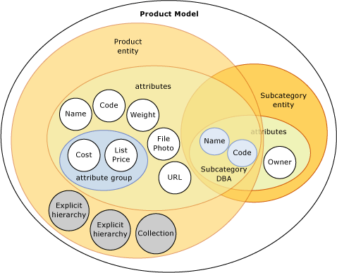
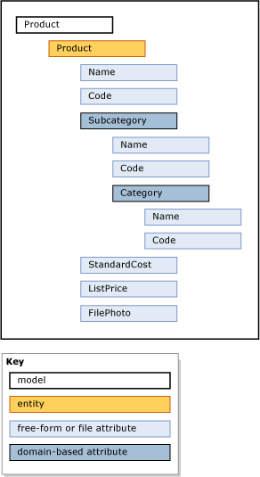

# Models (Master Data Services)
  Models are the highest level of data organization in [!INCLUDE[ssMDSshort](../includes/ssmdsshort-md.md)]. A model defines the structure of data in your master data management solution. A model contains the following objects:  
  
-   Entities  
  
-   Attributes and attribute groups  
  
-   Explicit and derived hierarchies  
  
-   Collections  
  
 Models organize the structure of your master data. Your [!INCLUDE[ssMDSshort](../includes/ssmdsshort-md.md)] implementation can have one or many models that each group similar kinds of data. In general, master data can be categorized in one of four ways: people, places, things, or concepts. For example, you can create a Product model to contain product-related data or a Customer model to contain customer-related data.  
  
 You can assign users and groups permission to view and update objects within the model. If you do not give permission to the model, it is not displayed.  
  
 At any given time, you can create copies of the master data within a model. These copies are called versions.  
  
 When you have defined a model in a test environment, you can deploy it, with or without the corresponding data, from the test environment to a production environment. This eliminates the need to recreate your models in your production environment.  
  
## How Models Relate to Other Objects  
 A model contains entities. Entities contain attributes, explicit hierarchies, and collections. Attributes can be contained in attribute groups. Domain-based attributes exist when an entity is used as an attribute for another entity.  
  
 This image shows the relationships among the objects in a model.  
  
   
  
> [!NOTE]  
>  Derived hierarchies are also model objects, but they are not shown in the image. Derived hierarchies are derived from the domain-based attribute relationships that exist between entities. See [Derived Hierarchies &#40;Master Data Services&#41;](derived-hierarchies-master-data-services.md) for more information.  
  
 Master data is the data that is contained in the model objects. In [!INCLUDE[ssMDSshort](../includes/ssmdsshort-md.md)], master data is stored as members in an entity.  
  
 Model objects are maintained in the **System Administration** functional area of the [!INCLUDE[ssMDSmdm](../includes/ssmdsmdm-md.md)] user interface.  
  
## Model Example  
 In the following example, the objects in the Product model logically group product-related data.  
  
   
  
 Other common models are:  
  
-   Accounts, which could include entities such as balance sheet accounts, income statement accounts, statistics, and account type.  
  
-   Customer, which could include entities such as gender, education, occupation, and marital status.  
  
-   Geography, which could include entities such as postal codes, cities, counties, states, provinces, regions, territories, countries, and continents.  
  
## Related Tasks  
  
|Task Description|Topic|  
|----------------------|-----------|  
|Create a model to organize your master data.|[Create a Model &#40;Master Data Services&#41;](../../2014/master-data-services/create-a-model-master-data-services.md)|  
|Change the name of an existing model.|[Change a Model Name &#40;Master Data Services&#41;](../../2014/master-data-services/change-a-model-name-master-data-services.md)|  
|Delete an existing model.|[Delete a Model &#40;Master Data Services&#41;](../../2014/master-data-services/delete-a-model-master-data-services.md)|  
  
## Related Content  
  
-   [Master Data Services Overview](master-data-services-overview-mds.md)  
  
-   [Entities &#40;Master Data Services&#41;](../../2014/master-data-services/entities-master-data-services.md)  
  
-   [Attributes &#40;Master Data Services&#41;](../../2014/master-data-services/attributes-master-data-services.md)  
  
-   [Deploying Models &#40;Master Data Services&#41;](../../2014/master-data-services/deploying-models-master-data-services.md)  
  
-   [Model Object Permissions &#40;Master Data Services&#41;](../../2014/master-data-services/model-object-permissions-master-data-services.md)  
  
  
