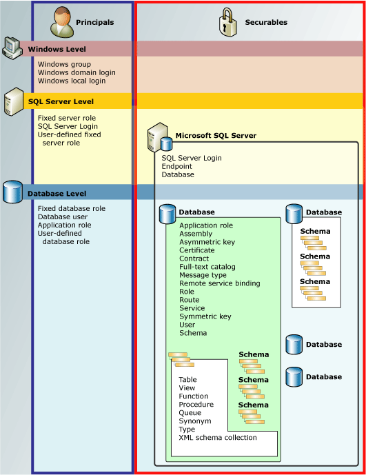

# Permissions Hierarchy (Database Engine)
  The [!INCLUDE[ssDE](../../../includes/ssde-md.md)] manages a hierarchical collection of entities that can be secured with permissions. These entities are known as *securables*. The most prominent securables are servers and databases, but discrete permissions can be set at a much finer level. [!INCLUDE[ssNoVersion](../../includes/ssnoversion-md.md)] regulates the actions of principals on securables by verifying that they have been granted appropriate permissions.

 The following illustration shows the relationships among the [!INCLUDE[ssDE](../../../includes/ssde-md.md)] permissions hierarchies.

 

## Chart of SQL Server Permissions
 For a poster sized chart of all [!INCLUDE[ssDE](../../../includes/ssde-md.md)] permissions in pdf format, see [https://github.com/microsoft/sql-server-samples/blob/master/samples/features/security/permissions-posters/Microsoft_SQL_Server_2017_and_Azure_SQL_Database_permissions_infographic.pdf](https://github.com/microsoft/sql-server-samples/blob/master/samples/features/security/permissions-posters/Microsoft_SQL_Server_2017_and_Azure_SQL_Database_permissions_infographic.pdf).

## Working with Permissions
 Permissions can be manipulated with the familiar [!INCLUDE[tsql](../../includes/tsql-md.md)] queries GRANT, DENY, and REVOKE. Information about permissions is visible in the [sys.server_permissions](/sql/relational-databases/system-catalog-views/sys-server-permissions-transact-sql) and [sys.database_permissions](/sql/relational-databases/system-catalog-views/sys-database-permissions-transact-sql) catalog views. There is also support for querying permissions information by using built-in functions.

## See Also
 [Securing SQL Server](securing-sql-server.md) 
 [Permissions &#40;Database Engine&#41;](permissions-database-engine.md) 
 [Securables](securables.md) 
 [Principals &#40;Database Engine&#41;](authentication-access/principals-database-engine.md) 
 [GRANT &#40;Transact-SQL&#41;](/sql/t-sql/statements/grant-transact-sql) 
 [REVOKE &#40;Transact-SQL&#41;](/sql/t-sql/statements/revoke-transact-sql) 
 [DENY &#40;Transact-SQL&#41;](/sql/t-sql/statements/deny-transact-sql) 
 [HAS_PERMS_BY_NAME &#40;Transact-SQL&#41;](/sql/t-sql/functions/has-perms-by-name-transact-sql) 
 [sys.fn_builtin_permissions &#40;Transact-SQL&#41;](/sql/relational-databases/system-functions/sys-fn-builtin-permissions-transact-sql) 
 [sys.server_permissions &#40;Transact-SQL&#41;](/sql/relational-databases/system-catalog-views/sys-server-permissions-transact-sql) 
 [sys.database_permissions &#40;Transact-SQL&#41;](/sql/relational-databases/system-catalog-views/sys-database-permissions-transact-sql)

