# Install SQL Server 2014 offline documentation

[!INCLUDE[appliesto-ss-xxxx-xxxx-xxx-md](../includes/applies-to-version/sqlserver.md)]

This article describes how to download and view offline SQL Server 2014 content. Offline content enables you to access the documentation without an internet connection (although an internet connection is initially required to download it).

The technique involves using the **Help** menu of SQL Server Management Studio (SSMS), to access the Help Viewer utility (HlpViewer.exe).

Offline documentation is available for versions of SQL Server in the range of 2012-2019, and perhaps for additional later versions too. Although you can view content for [previous versions online](https://docs.microsoft.com/previous-versions/sql/), an offline option provides a convenient way to access the older content.

- [SQL Server 2014](#sql-server-2014-offline-content)
- [SQL Server 2012](#sql-server-2012-offline-content)

For SQL Server 2016 and later versions, see their version-specific documentation to learn how those versions handle their offline documentation.

## SQL Server 2014 offline content

> [!IMPORTANT]
> SQL 2014 Transact-SQL content is only available offline.

The following steps explain how to load offline content for SQL Server 2014.

1. Download the [Product Documentation for Microsoft SQL Server 2014 for firewall and proxy restricted environments](https://www.microsoft.com/download/details.aspx?id=42557) content from the download center and save it to a folder.

2. Unzip the file to view the *.msha* file.

   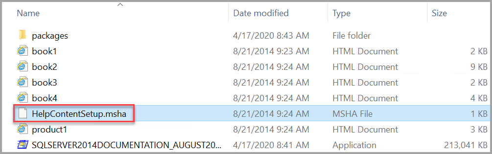

3. In SSMS, select **Add and Remove Help Content** on the Help menu.

   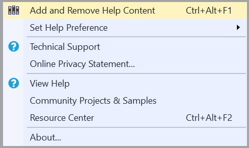

   The Help Viewer opens to the Manage Content tab.

4. To install the latest help content, choose **Disk** under Installation source and then the ellipses (...).

   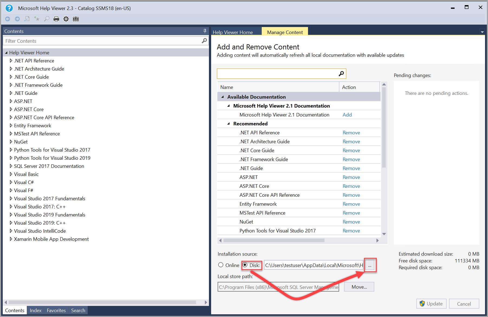

   > [!NOTE]
   > The Local store path on the Manage Content tab shows where on the local computer the content is located. To change the location, select **Move**, enter a different folder path in the **To** field, and then select **OK**.
   If the help installation fails after changing the Local store path, close and reopen the Help Viewer. Ensure the new location appears in the Local store path and then try the installation again.

5. Locate the folder where you unzipped the content. Select the **HelpContentSetup.msha** file in the folder then select **Open**.

   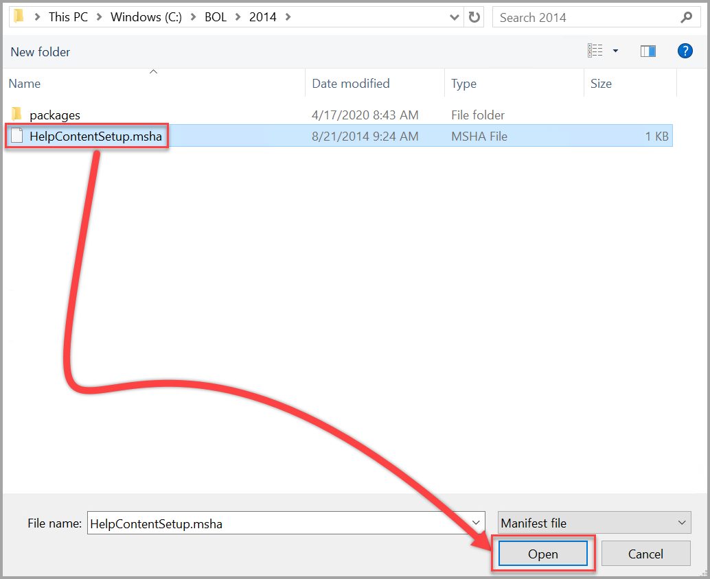

6. Type in *sql server 2014* in the search bar. Once you see the 2014 content available, select **Add** next to each content package (book) that you want to install to Help Viewer and then select **Update**.

   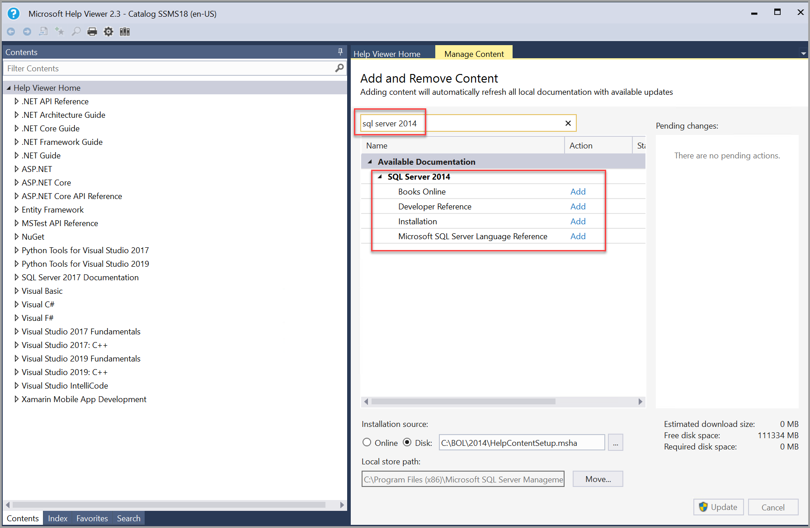

   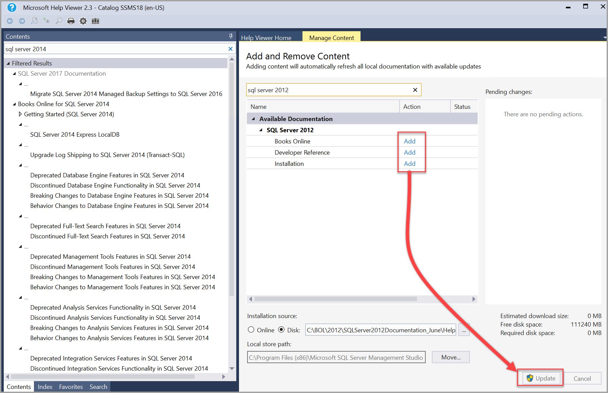

    > [!NOTE]
    > If the Help Viewer freezes (hangs) while adding content, change the Cache LastRefreshed="\<mm/dd/yyyy> 00:00:00" line in the %LOCALAPPDATA%\Microsoft\HelpViewer2.x\HlpViewer_SSMSx_en-US.settings or HlpViewer_VisualStudiox_en-US.settings file to some date in the future. For more information about this issue, see [Visual Studio Help Viewer freezes](/visualstudio/welcome-to-visual-studio).

7. You can verify that the SQL Server 2014 content installed by searching under the content pane on the left for *sql server 2014*.

   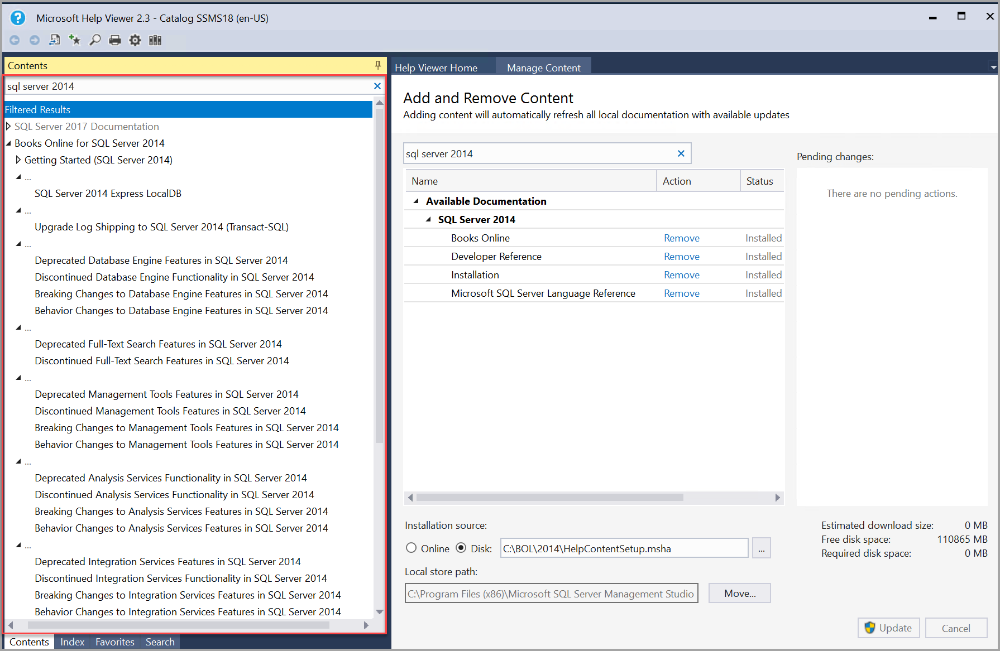

## SQL Server 2012 offline content

The following steps explain how to load offline content for SQL Server 2012

1. Download the [Product Documentation for Microsoft SQL Server 2012 for firewall and proxy restricted environments](https://www.microsoft.com/download/details.aspx?id=35750) content from the download center and save it to a folder.

2. Unzip the file to view the *.msha* file.

   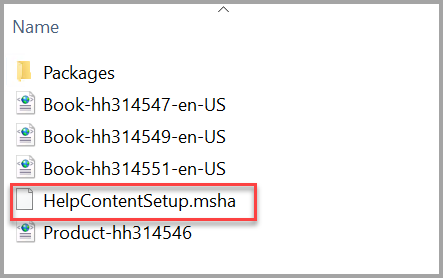

3. In SSMS, select **Add and Remove Help Content** on the Help menu.

   

   The Help Viewer opens to the Manage Content tab.

4. To install the latest help content, choose **Disk** under Installation source and then the ellipses (...).

   

   > [!NOTE]
   > The Local store path on the Manage Content tab shows where on the local computer the content is located. To change the location, select **Move**, enter a different folder path in the **To** field, and then select **OK**.
   If the help installation fails after changing the Local store path, close and reopen the Help Viewer. Ensure the new location appears in the Local store path and then try the installation again.

5. Locate the folder where you unzipped the content. Select the **HelpContentSetup.msha** file in the folder then select **Open**.

   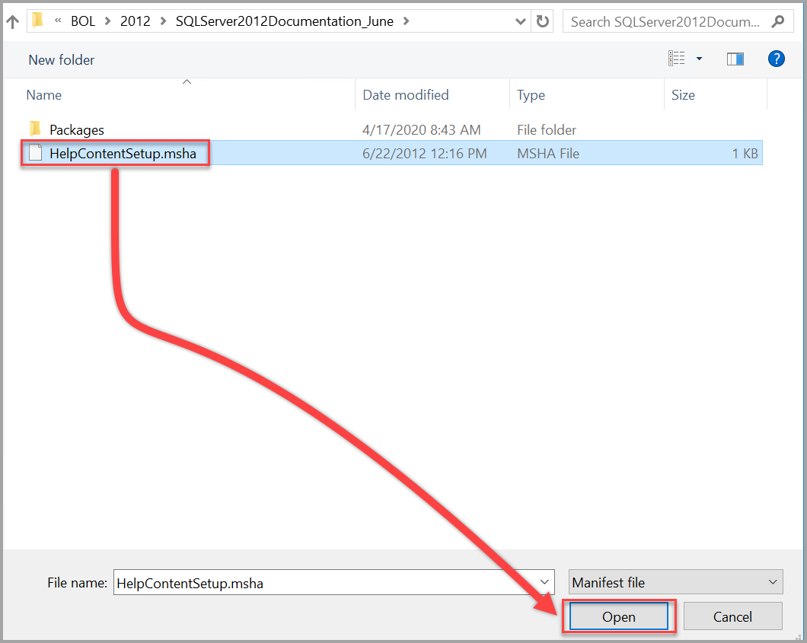

6. Type in *sql server 2012* in the search bar. Once you see the 2012 content available, select **Add** next to each content package (book) that you want to install to Help Viewer and then select **Update**.

   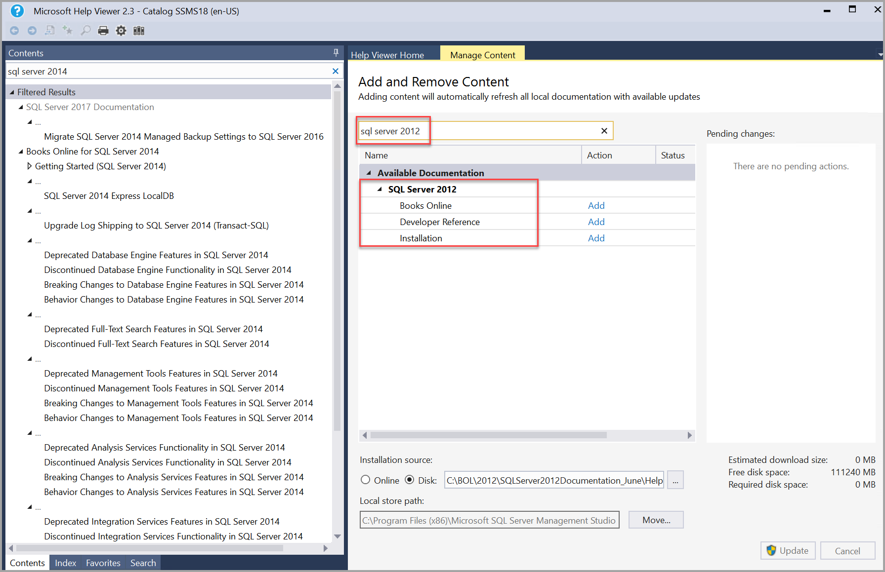

   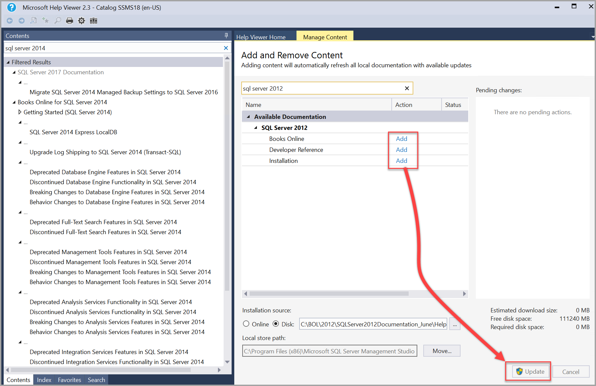

    > [!NOTE]
    > If the Help Viewer freezes (hangs) while adding content, change the Cache LastRefreshed="\<mm/dd/yyyy> 00:00:00" line in the %LOCALAPPDATA%\Microsoft\HelpViewer2.x\HlpViewer_SSMSx_en-US.settings or HlpViewer_VisualStudiox_en-US.settings file to some date in the future. For more information about this issue, see [Visual Studio Help Viewer freezes](/visualstudio/welcome-to-visual-studio).

7. You can verify that the SQL Server 2012 content is loaded by searching under the content pane on the left for *sql server 2012*.

   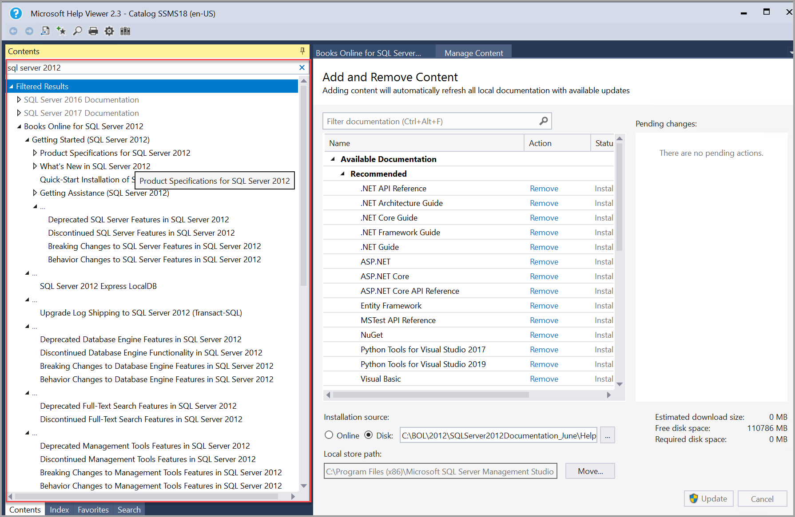

## View offline documentation

You can view SQL Server help content using the **HELP** menu in the latest version of [SQL Server Management Studio (SSMS)](../ssms/download-sql-server-management-studio-ssms.md).

### View offline help content in SSMS

To view the installed help in SSMS, select **Launch in Help Viewer** from the Help menu, to launch the Help Viewer.

   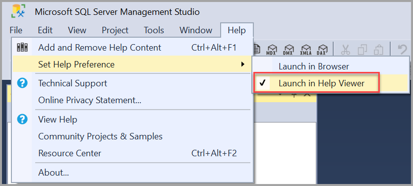  

Help Viewer opens to the Manage Content tab, with the installed help table of contents in the left pane. select articles in the table of contents to display them in the right pane.

> [!Important]
> If the contents pane is not visible, select Contents on the left margin. select the pushpin icon to keep the contents pane open.  

   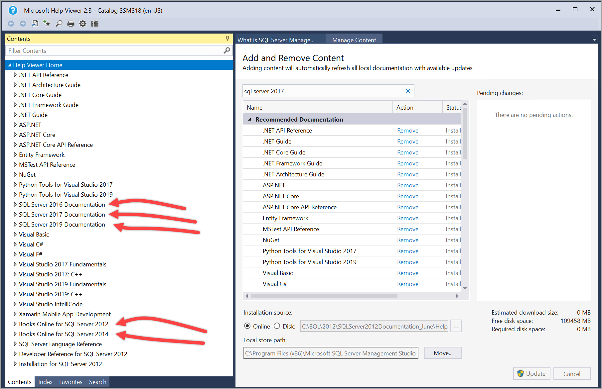
