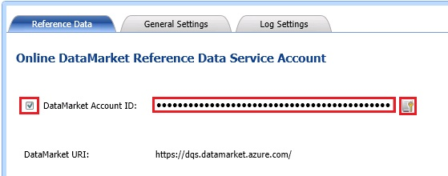

# Task 9: Configuring a Reference Data Service
  In this task, you configure DQS to use a Reference Data Service on Azure Marketplace. In the next task, you will configure the **Address Validation** domain to use this service. At runtime, during cleansing activity, DQS passes the values of domains in the **Address Validation** domain to the service for cleansing. See [Configure DQS to Use Reference Data](https://msdn.microsoft.com/library/hh213070.aspx) for more details.  
  
1.  In the main page of **DQS Client**, in the **Administration** pane, click **Configuration**.  
  
2.  Ensure that **Reference Data** tab is active.  
  
3.  In the **Network Settings** area, type appropriate values in the **Proxy Server** and **Port** fields if you need to use a proxy server to connect to Internet.  
  
4.  Type your **Azure Marketplace Account Key** for the **DataMarket Account ID** field.  
  
       
  
5.  Click **Validate** button next to the text box to validate the account ID.  
  
6.  Click **OK** on the message box.  
  
7.  Click **Close** at the bottom of the page to switch to the main page of DQS Client.  
  
## Next Task  
 [Task 10: Configuring Composite Domain to Use Reference Data Service](../../2014/tutorials/task-10-configuring-composite-domain-to-use-reference-data-service.md)  
  
  
